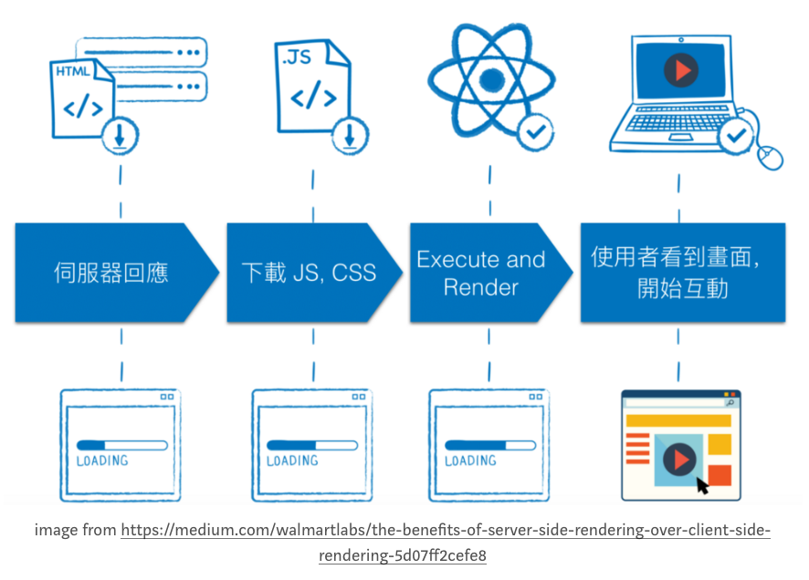
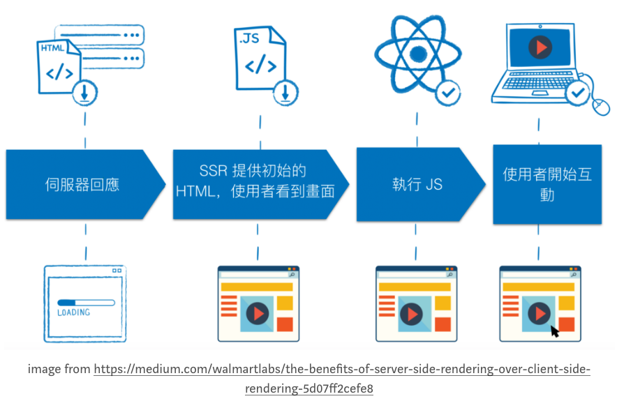

# Server-Side Render (SSR)

#### SSR 除了 SEO Improvement 之外，更重要的效益在於 User Experience

### CSR

使用者在前三個畫面的狀態時，依舊盯著空白畫面發呆．

直到第四個畫面，使用者才能開始互動，但是在這個網路蓬勃發展的年代，若載入的時間超過三秒，使用者早就關掉瀏覽器了．

### SSR

## SSR Advantage
    1. SEO improvement
    2. Increase loading speed
    3. Decrease API fetch round-trip time

## React SSR 遇到的問題
    1. React 第三方 Module 的不同需求
    2. 第三方 Module SSR 支援程度
    3. Blocking Event-loop
    4. 只有 NodeJS 環境可以 SSR

# Q
* 如果用SSR，React透過Middleware去要求資料，回傳是資料還是頁面
* use tool?

# Reference
### [Coren: 最簡單，最有彈性的 React Sever-side Render 解決方案](https://medium.com/canner-io-%E6%98%93%E9%96%8B%E7%A7%91%E6%8A%80/coren-%E6%9C%80%E7%B0%A1%E5%96%AE-%E6%9C%80%E6%9C%89%E5%BD%88%E6%80%A7%E7%9A%84-react-sever-side-render-%E8%A7%A3%E6%B1%BA%E6%96%B9%E6%A1%88-b36e708d3956)
